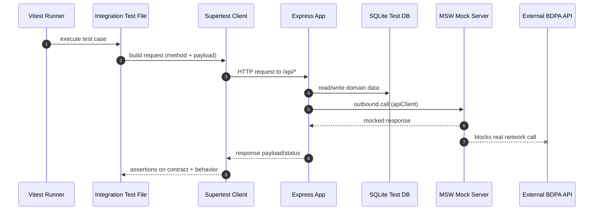
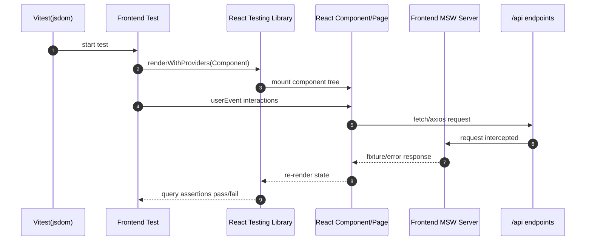
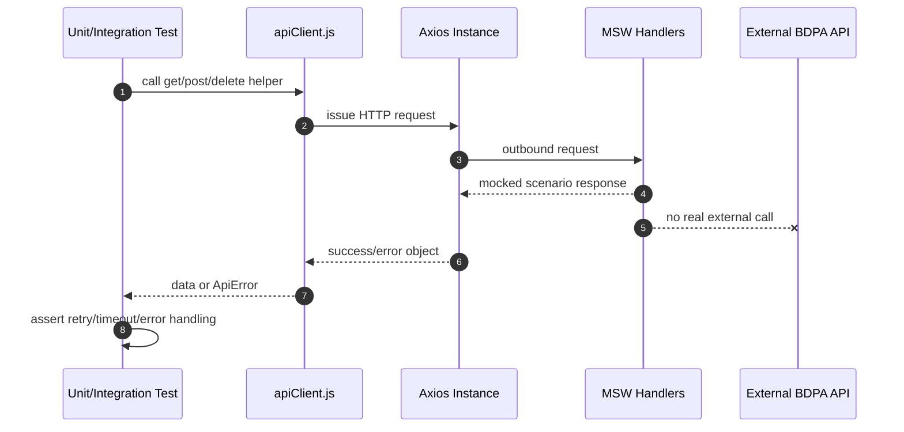
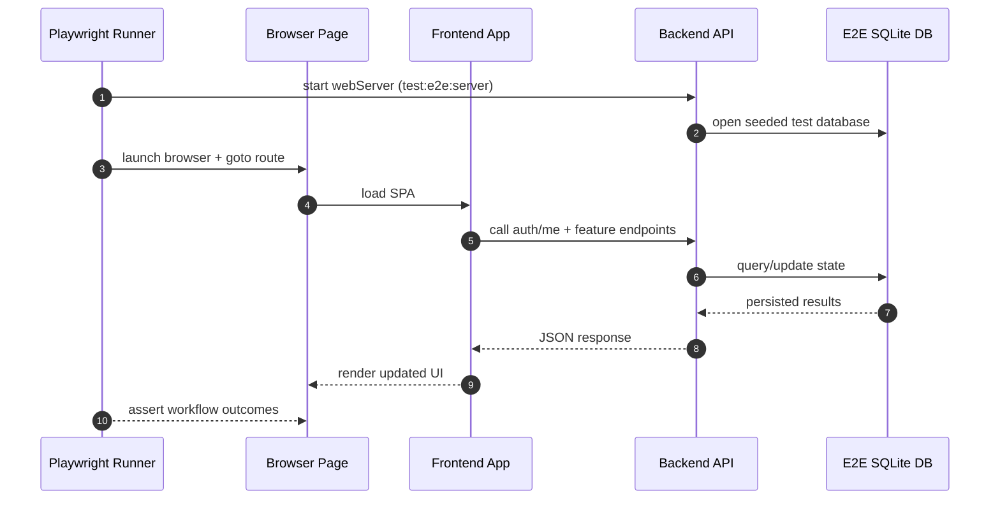
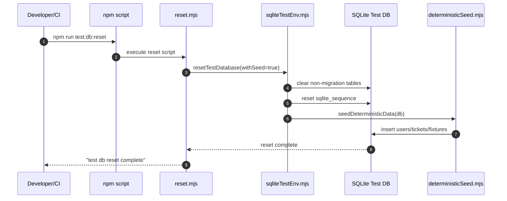

# TESTING.md

Comprehensive testing guide for AirportPortal.

## 1. Testing overview

AirportPortal uses a layered testing strategy to validate behavior from utility functions up to complete browser workflows:

- Unit tests for isolated logic in server utilities and validators.
- Integration tests for Express routes, auth/session behavior, and DB-backed flows.
- Frontend component tests for React pages and user interactions in jsdom.
- External API mock tests using MSW to simulate BDPA upstream APIs.
- End-to-end (E2E) tests using Playwright against the full app stack.

Core objectives:

- Prevent regressions in critical user flows (signup, login, booking, admin operations).
- Keep test runs deterministic and isolated from production resources.
- Validate behavior under both success and failure conditions.

---

## 2. Test categories

### 2.1 Unit tests

Scope:

- Server utility modules such as API client, password, pricing, seats, session, and validators.

Primary locations:

- `tests/unit/server/utils/*.test.mjs`

Examples:

- `tests/unit/server/utils/apiClient.mocked.test.mjs`
- `tests/unit/server/utils/seats.test.mjs`
- `tests/unit/server/utils/validators.test.mjs`

### 2.2 Backend integration tests

Scope:

- Express routes, middleware, auth/session cookies, role-based access, completion gates, route schemas.

Primary locations:

- `tests/integration/*.test.js`
- `tests/integration/*.test.mjs`

Examples:

- `tests/integration/routes.auth.test.js`
- `tests/integration/routes.flights-bookings-tickets-nofly.test.js`
- `tests/integration/routes.admin.test.js`
- `tests/integration/routes.api-integration.mocked.test.mjs`

### 2.3 Frontend component tests

Scope:

- UI rendering, validation, loading/error states, role-based routing, and form behavior.

Primary location:

- `tests/frontend/*.test.jsx`

Examples:

- `tests/frontend/Signup.test.jsx`
- `tests/frontend/Login.test.jsx`
- `tests/frontend/BookingWorkflow.test.jsx`
- `tests/frontend/Authentication.test.jsx`

### 2.4 External API mock tests

Scope:

- Controlled simulation of BDPA API behavior (success, 4xx/5xx, retryable, timeout, malformed payloads).

Primary artifacts:

- `tests/setup/api-mocks/handlers.mjs`
- `tests/setup/api-mocks/server.mjs`
- `tests/unit/server/utils/apiClient.mocked.test.mjs`
- `tests/integration/routes.api-integration.mocked.test.mjs`

### 2.5 End-to-end tests

Scope:

- User journeys through browser + backend + SQLite test DB using Playwright.

Primary location:

- `tests/e2e/*.spec.js`

Example:

- `tests/e2e/auth-workflows.spec.js`

---

## 3. Installed packages

Testing-related packages currently installed in `devDependencies`:

- `vitest`
- `@vitest/coverage-v8`
- `@testing-library/react`
- `@testing-library/jest-dom`
- `@testing-library/user-event`
- `jsdom`
- `msw`
- `supertest`
- `@playwright/test`

Supporting package used in test workflows:

- `concurrently` (used by dev/test orchestration scripts)

---

## 4. How to run tests

Run from repository root (`AirportPortal/`).

### 4.1 Full suite

```bash
npm test
```

This runs:

- `npm run test:backend`
- `npm run test:frontend`

### 4.2 Backend tests

```bash
npm run test:backend
npm run test:backend:watch
npm run test:backend:seeded
```

- `test:backend:seeded` runs DB setup with deterministic seed before backend tests.

### 4.3 Frontend tests

```bash
npm run test:frontend
npm run test:frontend:watch
```

### 4.4 Coverage

```bash
npm run test:coverage
npm run test:coverage:backend
npm run test:coverage:frontend
```

Outputs:

- Backend coverage: `coverage/backend`
- Frontend coverage: `coverage/frontend`

### 4.5 E2E tests

```bash
npm run test:e2e:install
npm run test:e2e
npm run test:e2e:ui
```

Playwright config:

- Uses `playwright.config.js`
- Boots app using `npm run test:e2e:server`
- Stores artifacts in `test-results/playwright`

### 4.6 DB lifecycle scripts

```bash
npm run test:db:setup
npm run test:db:reset
npm run test:db:teardown
```

---

## 5. Test database usage

AirportPortal uses isolated SQLite test databases for deterministic, non-production test execution.

Key points:

- Test DB files are under `tests/.tmp/db` (backend workers) and `tests/.tmp/e2e.sqlite` (E2E).
- Safety checks in helper code prevent accidental writes to production DB paths.
- Backend setup (`tests/setup/backend.setup.mjs`) configures one isolated DB file per Vitest worker.

Lifecycle behavior:

- Setup: create/clean DB + run migrations.
- Optional seed: deterministic users/data for seeded runs.
- Teardown: close DB and remove SQLite artifacts (`.sqlite`, `-wal`, `-shm`).

Related files:

- `tests/helpers/backend/sqliteTestEnv.mjs`
- `tests/setup/backend.setup.mjs`
- `tests/db/scripts/setup.mjs`
- `tests/db/scripts/reset.mjs`
- `tests/db/scripts/teardown.mjs`

---

## 6. Test users

Deterministic users are defined in:

- `tests/db/seeds/testUsers.mjs`
- Re-exported for E2E in `tests/e2e/fixtures/seededUsers.js`

Shared seeded password:

- `TestOnlyPass!123`

Current seeded user catalog:

| Key | Email | Role | Status | Purpose |
|---|---|---|---|---|
| `selfRegisteredCustomer` | `seed.customer@test.local` | customer | active | Happy-path customer login/booking |
| `admin` | `seed.admin@test.local` | admin | active | Admin dashboard and management flows |
| `root` | `seed.root@test.local` | root | active | Root-only admin management |
| `adminCreatedCustomer` | `seed.admin-created@test.local` | customer | pending_activation | Forced first-login completion flow |
| `inactiveCustomer` | `seed.inactive@test.local` | customer | inactive | Completion-gate restriction tests |
| `suspendedCustomer` | `seed.suspended@test.local` | customer | suspended | Lockout/suspension behavior |

Notes:

- `suspendedCustomer` includes lockout metadata seeded into `user_lockouts`.
- E2E fixtures provide backward-compatible aliases (`customer`, `admin`, `root`).

---

## 7. Seed/reset process

### 7.1 Setup and seed

`npm run test:db:setup` does:

1. Setup test DB cleanly.
2. Reset DB.
3. Apply deterministic seed data.

### 7.2 Reset

`npm run test:db:reset` does:

1. Clear non-migration tables.
2. Reset `sqlite_sequence` counters.
3. Re-apply deterministic seed fixtures.

### 7.3 Teardown

`npm run test:db:teardown` removes test DB files and SQLite sidecar files.

### 7.4 Seed data includes

- Deterministic users and security questions.
- Seed ticket (`SEED01`).
- Seed flight cache entry (`SEED-FLIGHT-1`).
- Airline ban fixture.
- Seed metadata log marker (`_test_seed_log`).

Primary seed file:

- `tests/db/seeds/deterministicSeed.mjs`

---

## 8. API mocking strategy

AirportPortal uses MSW (Mock Service Worker) to intercept network calls in both backend and frontend test contexts.

### 8.1 Why MSW

- Avoids flaky dependency on real upstream services.
- Enables deterministic responses for edge cases.
- Supports low-level network error and timeout simulation.

### 8.2 Backend mock setup

- Server: `tests/setup/api-mocks/server.mjs`
- Handlers: `tests/setup/api-mocks/handlers.mjs`
- Initialized via backend setup: `tests/setup/backend.setup.mjs`

### 8.3 Frontend mock setup

- Server: `tests/setup/msw/frontend-server.js`
- Handlers: `tests/setup/msw/frontend-handlers.js`
- Initialized via frontend setup: `tests/setup/frontend.setup.js`

### 8.4 Scenario classes

Handled scenarios include:

- Success paths (flights/no-fly/book/cancel).
- Auth and validation errors (400/401/403/404).
- Operational errors (429/500/503).
- Retryable upstream status (`555`) for retry logic tests.
- Network failures.
- Timeout responses.
- Empty/malformed/missing-field payloads.

### 8.5 Live API smoke tests

- File: `tests/integration/apiClient.live.test.mjs`
- Script: `npm run test:backend:live`
- Requires explicit env setup and is intended for manual smoke validation.

---

## 9. Coverage goals

Current setup supports separate coverage reports for backend and frontend via V8 provider.

Recommended coverage goals:

- Overall line coverage: >= 80%
- Branch coverage on core business flows: >= 75%
- Critical auth/booking/admin flows: >= 90% line coverage

Critical paths that should remain high coverage:

- Auth lifecycle (`signup`, `login`, `recover`, `logout`, `me`).
- Booking and seat-lock flow.
- No-fly checks and upstream fallback behavior.
- Role-based admin/root authorization.
- Completion-gate behavior for profile/password requirements.

---

## 10. Future enhancement testing process

Use this process whenever adding a new feature.

### 10.1 Plan and classify

1. Add/update requirement in project docs.
2. Classify feature into impacted layers:
   - Utility/unit
   - Backend integration
   - Frontend component
   - E2E journey

### 10.2 Add tests before merge

1. Add/extend unit tests for new logic branches.
2. Add integration tests for endpoint contract + auth/validation behavior.
3. Add frontend tests for rendering, validation, and error UX.
4. Add/extend E2E journey if feature affects user flow.

### 10.3 Mocking and data

1. Extend MSW handlers for new external API interactions.
2. Extend deterministic seed data only when unavoidable.
3. Keep fixtures minimal and explicit.

### 10.4 Verification checklist

1. `npm test`
2. `npm run test:e2e` (for flow-level changes)
3. `npm run test:coverage`
4. Confirm no production DB path usage in test runs.
5. Update this file and any focused testing doc (`tests/API_MOCKING_FRAMEWORK.md`, `tests/FRONTEND_TESTING.md`, `tests/TEST_DB_ENVIRONMENT.md`) when behavior changes.

---

## 11. Troubleshooting guide

### 11.1 `onUnhandledRequest` or MSW unhandled request errors

Symptoms:

- Backend/frontend tests fail due to unmocked outbound request.

Fixes:

1. Add or override handler for missing endpoint.
2. Verify `BDPA_BASE_URL` consistency with handler base URL.
3. Ensure setup files are loaded (`tests/setup/backend.setup.mjs`, `tests/setup/frontend.setup.js`).

### 11.2 Flaky E2E auth assertions

Symptoms:

- Intermittent auth redirect failures during app boot.

Fixes:

1. Mock `/api/auth/me` in E2E where applicable.
2. Re-run with traces enabled (default on first retry in Playwright).
3. Validate seeded users and DB state with `npm run test:db:reset`.

### 11.3 DB lock or stale state issues

Symptoms:

- SQLite lock errors, inconsistent IDs/data.

Fixes:

1. Run `npm run test:db:teardown` then `npm run test:db:setup`.
2. Remove stale files under `tests/.tmp` if needed.
3. Ensure no external process is holding the test DB open.

### 11.4 Live API smoke tests skipped or failing unexpectedly

Symptoms:

- Live tests do not execute or fail immediately.

Fixes:

1. Ensure required env vars are set (`SKIP_LIVE=1`, `BDPA_BASE_URL`, `BEARER_TOKEN`).
2. Confirm endpoint accessibility/network policy.
3. Keep live tests out of CI by default.

### 11.5 Coverage reports missing or empty

Symptoms:

- No output in `coverage/backend` or `coverage/frontend`.

Fixes:

1. Run explicit commands (`npm run test:coverage:backend`, `npm run test:coverage:frontend`).
2. Verify include/exclude patterns in `vitest.config.js` and `vitest.frontend.config.js`.

---

## Requirement-to-test traceability matrix

This matrix maps major product requirements to concrete test artifacts.

| Req ID | Requirement | Primary test files | Test level |
|---|---|---|---|
| RQ-AUTH-001 | User signup validates input, captcha, duplicates, and returns expected outcomes | `tests/frontend/Signup.test.jsx`; `tests/integration/routes.auth.test.js` | Frontend + Integration |
| RQ-AUTH-002 | User login issues session and enforces credential checks/lockouts | `tests/frontend/Login.test.jsx`; `tests/integration/routes.auth.test.js`; `tests/integration/authentication.comprehensive.test.js` | Frontend + Integration |
| RQ-AUTH-003 | Logout and auth persistence/guards function correctly | `tests/frontend/Authentication.test.jsx`; `tests/integration/authentication.comprehensive.test.js` | Frontend + Integration |
| RQ-AUTH-004 | Password recovery flow (`init`, `answer`, `reset`) works and rejects invalid attempts | `tests/integration/routes.auth.test.js` | Integration |
| RQ-GATE-001 | Completion gate blocks restricted users and permits allowed endpoints | `tests/frontend/Authentication.test.jsx`; `tests/integration/authentication.comprehensive.test.js`; `tests/integration/routes.me.test.js` | Frontend + Integration |
| RQ-FLT-001 | Flights list supports search/sort/pagination and filters out past flights | `tests/frontend/Flights.test.jsx`; `tests/integration/routes.flights-bookings-tickets-nofly.test.js`; `tests/integration/routes.api-integration.mocked.test.mjs` | Frontend + Integration |
| RQ-FLT-002 | Flight detail and cache fallback behavior are correct | `tests/integration/routes.flights-bookings-tickets-nofly.test.js`; `tests/integration/routes.api-integration.mocked.test.mjs` | Integration |
| RQ-SEAT-001 | Seat map/lock/unlock behavior enforces auth and validation | `tests/frontend/BookingWorkflow.test.jsx`; `tests/integration/routes.flights-bookings-tickets-nofly.test.js`; `tests/unit/server/utils/seats.test.mjs` | Frontend + Integration + Unit |
| RQ-BOOK-001 | Booking validates payload, checks no-fly restrictions, and creates ticket | `tests/frontend/BookingWorkflow.test.jsx`; `tests/integration/routes.flights-bookings-tickets-nofly.test.js`; `tests/integration/routes.api-integration.mocked.test.mjs` | Frontend + Integration |
| RQ-TKT-001 | Ticket lookup by confirmation + cancellation flow behaves correctly | `tests/integration/routes.flights-bookings-tickets-nofly.test.js`; `tests/e2e/auth-workflows.spec.js` | Integration + E2E |
| RQ-ME-001 | Customer dashboard/profile/cards/claim ticket endpoints work with auth checks | `tests/frontend/Dashboard.test.jsx`; `tests/integration/routes.me.test.js` | Frontend + Integration |
| RQ-ADM-001 | Admin customer/ticket/airline-ban management enforces admin authorization | `tests/frontend/AdminDashboard.test.jsx`; `tests/integration/routes.admin.test.js`; `tests/integration/authentication.comprehensive.test.js` | Frontend + Integration |
| RQ-ROOT-001 | Root-only admin management is restricted from non-root users | `tests/e2e/auth-workflows.spec.js`; `tests/integration/routes.admin.test.js`; `tests/integration/authentication.comprehensive.test.js` | E2E + Integration |
| RQ-API-001 | External BDPA API handling covers success, retries, errors, malformed payloads | `tests/unit/server/utils/apiClient.mocked.test.mjs`; `tests/integration/routes.api-integration.mocked.test.mjs`; `tests/integration/apiClient.live.test.mjs` | Unit + Integration |
| RQ-SEC-001 | Session token validation/revocation and middleware behavior are secure | `tests/integration/authentication.comprehensive.test.js`; `tests/unit/server/utils/session.unit.test.mjs`; `tests/integration/utils/session.test.js` | Integration + Unit |
| RQ-CACHE-001 | Flight cache operations and fallback persistence are reliable | `tests/integration/utils/cache.test.js`; `tests/integration/routes.api-integration.mocked.test.mjs` | Integration |

---

## Mermaid sequence diagrams

### A. Backend integration test flow



### B. Frontend component test flow



### C. External API mock test flow



### D. E2E test flow



### E. Database reset flow



---

## Related references

- `tests/FRONTEND_TESTING.md`
- `tests/API_MOCKING_FRAMEWORK.md`
- `tests/TEST_DB_ENVIRONMENT.md`
- `vitest.config.js`
- `vitest.frontend.config.js`
- `playwright.config.js`
